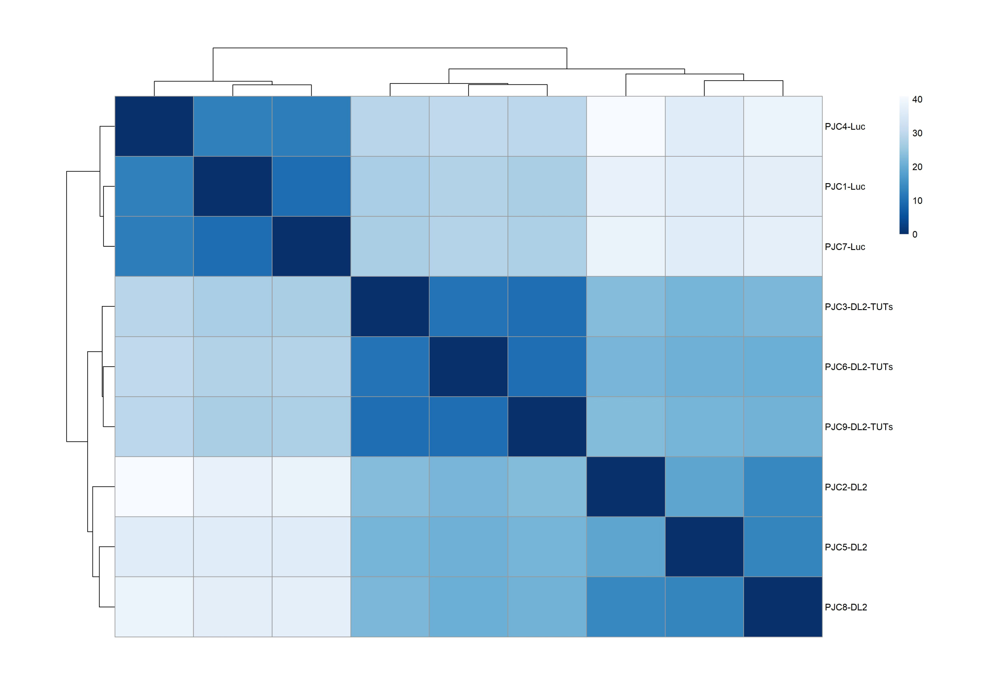

# RNAseq-analysis
---
### Objective

The purpose of this repository is to estimate differentially expressed genes (DEGs) from a high-throughput sequencing experiment. DEGs were identified by analyzing read counts per gene across all experimental conditions using the DESeq2 Bioconductor package (v.1.20.0), which model count data with negative normal distributions. The counts were normalized to the library size, using the rlog method. Gene ontology (GO) analysis of DEG was performed using the R package, clusterProfiler from Bioconductor. KEGG canonical pathways were used for pathway enrichment analysis.

---
### Context

Total RNA extracts were initially obtained from SW480 cells treated with siRNAs targeting either LUC, DIS3L2 or DIS3L2+TUTs. RNA libraries were prepared from three independent biological replicates for each condition and enriched for long RNAs (> 200 nucleotides) by poly(A) selection. Next, mRNA was fragmented and converted to first strand cDNA using reverse transcriptase and random primers. Then, libraries were run on an Illumina HiSeq 2500 sequencing platform generating around 20 million paired end reads with an average read length of 282 base pairs.

---
### Data visualization

Heatmap of all genes detected by the RNA-seq, with a minimum of 11 counts in at least one sample. Genes are represented in the vertical axis, conditions in the horizontal axis and expression values are displayed as a Z-score (mean = 0) across samples. Color saturation represents the magnitude of deviation from the median (green and red color saturation correspond to values that are lower and greater than the row mean, respectively).

  

Sample-to-sample distance heatmap calculated after estimation of stabilized variance of normalized counts of gene expression across replicates. Square color saturation indicates relationship between transcriptomes of all RNA-seq samples.

  

